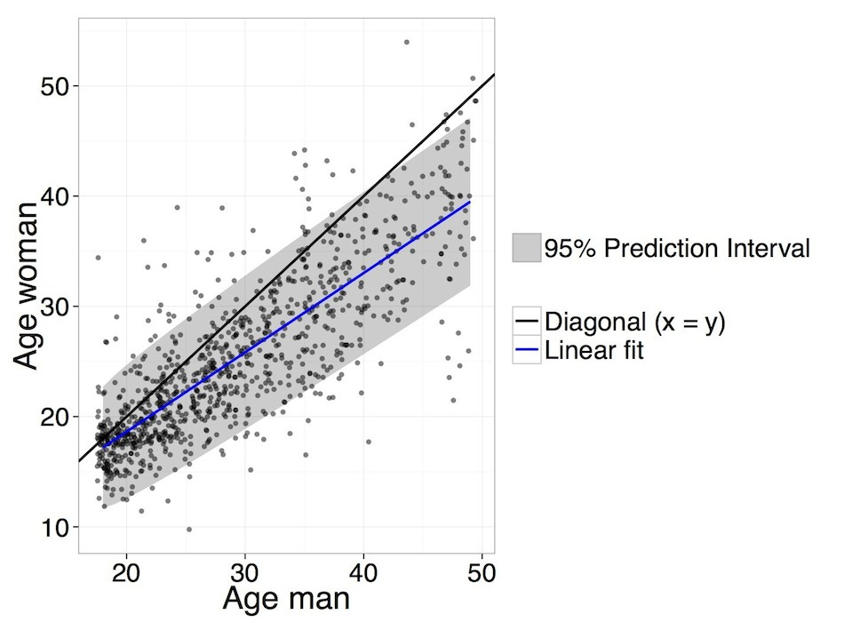

### <span style="color:red;">To do list for this tutorial</span>
* create git repository for tutorial
* rewrite post-sim functions, so that they only need a simpactoutput object (e.g. testrunx) instead of datalist$table and cfg object
* wrap functions for post-simulation analysis of age-mixing and epidemic trajectory in RSimpactHelper package
* Split tutorial in two: first exploration in part 1, answering research question in part 2.

### Background
It is well known that people do not form sexual relationships at random with respect to the age of their partners. We can say that there exists an assortative age-mixing pattern. That is, most people form relationships with partners who are more or less in the same age group as themselves. However, the distribution of age gaps between sexual partners is typically not centred around zero. Rather, the average age gap is usually about 2 or 3 years (i.e. the man is 2-3 years older than the woman).

### Scope of this tutorial
In this tutorial, we are going to use an agent-based model to explore how the age-mixing pattern may influence the epidemiology of HIV, loosely inspired by previously published data on age-mixing and HIV epidemic trajectories. Before diving into the actual research question, we are first going to construct a few toy models to get familiar with the general work flow of setting up models with Simpact and fitting them to data.

Next, we will develop a number of age-structured agent-based models, specifically designed to address our research question. By "age-structed" we explicitly mean that the rules for forming sexual relationships depend on the age(-gap) of the individuals in the model population. We will use these models to simulate dynamic sexual networks. After some “warm up” period, during which the sexual network reaches a dynamic equilibrium, we will introduce HIV into the model population, and simulate how HIV is transmitted across the network over time. We will summarise the simulation output with a small set of indicators of the epidemic trajectory, and we will perform a simple statistical analysis to capture the association between the age-mixing pattern and epidemic trajectory.

To summarise the age-mixing pattern, we will compute the average age difference across all relationships (AAD) and the variance of these age differences (VAD). We will also decompose the variance of age differences into a within-subject (WVAD) and between-subject (BVAD) part. Our main indicator of the HIV epidemic is the incidence of HIV. We could also look at HIV prevalence, but in the absence of temporal chances in the hazard of HIV-related mortality, HIV prevalence does not tell us anything extra we couldn’t learn from studying HIV incidence. Besides computing the overall, cumulative HIV incidence in the population, we are also interested in the age- and gender-specific HIV incidence over the relevant simulation period (from introduction of HIV until end of the simulation).

The emphasis of this modelling exercise is not on trying to create the model that reproduces observed age-mixing patterns and HIV epidemic trends most faithfully. Rather, we purposefully keep our models overly simple, like caricatures, to facilitate the analysis and remain focused on the key questions.

### Research questions
Our central research question is: How does the time-age-gender-specific HIV incidence change as a function of AAD, WVAD and BVAD?

To give a (preliminary) answer to this question, we will construct X models that each produce distinct values of AAD, WVAD and BVAD. In the process, we will constrain these models such that the total number of relationships that are formed per unit of time during the dynamic equilibrium phase is similar across all models.

### Getting ready
If you haven't already done so, you need to first install the [core SimpactCyan C++ program](http://research.edm.uhasselt.be/~jori/simpact/programs/). MS-Windows users also need to install the [Visual Studio 2013 redistributable package](https://www.microsoft.com/en-us/download/details.aspx?id=40784). Next, you should install a few R packages. Make sure you have a recent version of R installed (not older than version 3.1.1.).

```{r install, eval=FALSE}
install.packages("RJSONIO", repos="https://cran.rstudio.com")
install.packages("findpython", repos="https://cran.rstudio.com")
install.packages("rPithon", repos="http://research.edm.uhasselt.be/jori")
install.packages("RSimpactCyan", repos="http://research.edm.uhasselt.be/jori")
```


### Setting up a model with Simpact
Assuming that you have successfully installed both the SimpactCyan core package and the required R packages, load the RSimpactCyan package and check out what functions are available. We are also going to need some other packages in this tutorial. You may need to install these first, before you can load them with the `library()` function. And we are going to load some additional helperfunctions.
```{r load_packages, message=FALSE}
library(RSimpactCyan)
library(EasyABC)
library(data.table)
library(nlme)
library(ggplot2)
library(RColorBrewer)
library(shape)
library(reshape2)
library(sna)
library(phylobase)
library(MASS)
help(package="RSimpactCyan")
source(file="/Users/wimdelva/GoogleDrive/Bruges2015/Tutorial/src/postsim.R")
```

To run a Simpact model with the default model parameters, we run the `run.simpact()` function, and give it an empty list as input. We will store the model output in directory <code>/tmp/simpacttest</code>, which will be created on the fly. Note that this directory will be erased next time we open a new R session. Lastly, there are additional arguments we can optionally specify. We can define an identifier of the output files that we will create and store. We are only running 1 test simulation, so we could call it today's date and attach the number 1 to it. We can also set the seed of the random number generator, which can be useful if being able to reproduce the simulation output is important.

```{r run_default, cache=TRUE, results="hide"}
cfg <- list()
DestDir <- "/Users/wimdelva/GoogleDrive/Bruges2015/Tutorial/simoutput"
simID <- 1
identifier <- paste0("%T-%y-%m-%d-", simID, "-")

testrun1 <- simpact.run(cfg,
                       DestDir,
                       identifierFormat = identifier,
                       seed = 1234)
```

The simulation output is stored in several files in the destination directory. The <code>output.txt</code> file contains "meta data" such as the version of Simpact and seed of the random number generator that were used, the total number of events that took place and the size of the model population at the start and end of the simulation. The <code>simpact-cyan-my-identifier-eventlog.csv</code> file stores each event in a separate row, the <code>simpact-cyan-my-identifier-personlog.csv</code> file stores key information for each person in a separate row, and the <code>simpact-cyan-my-identifier-relationlog.csv</code> file stores each relationship separately. The <code>simpact-cyan-my-identifier-treatmentlog.csv</code> file keeps track of episodes of antiretroviral treatment. Lastly, the <code>simpact-cyan-my-identifier-config.txt</code> file stores the model parameter values that were used for the simulation.

`simpact.showconfig(NULL)` lets you see all the model parameters that can be modified, what options you have when modifying them, and what the default values are. As you can see, there are many parameters that you can change, and not all parameters are used. For instance, there are two types of hazard function for the event of relationship formation that can be specified: `formation.hazard.type = "simple"` or `formation.hazard.type = "agegap"`, with the latter being the default.

We can edit the model configuration by making changes to the cfg list (which was empty thus far). Let's shorten the simulation time to 3 years and start with 500 women and 500 men, and then run the updated model.
```{r update_cfg, cache=TRUE, results="hide"}
cfg["population.simtime"] <- 3
cfg["population.numwomen"] <- 500
cfg["population.nummen"] <- 500
simID <- 2
identifier <- paste0("%T-%y-%m-%d-", simID, "-")

testrun2 <- simpact.run(cfg,
                       DestDir,
                       identifierFormat = identifier,
                       seed = 1234)
```

### Exploring model output Part 1

```{r model_output}
datalist <- readthedata(modeloutput = testrun2)
names(datalist)
str(datalist)
```

##### Visualising the age-mixing scatter
```{r plot_agescatter}
# ptable$TOB is the time of birth.
# If you were 20 years old at the start of the simulation (time=0), then your
# TOB is -20
agemixingdata <- agemixing(datalist$ptable, datalist$rtable)
names(agemixingdata)
names(agemixingdata$agemixingdata)
names(agemixingdata$agescatterdata)

agescatter <- agemixingdata$agescatterdata
scatterplot <- ggplot(data = agescatter, aes(x = AgeMaleatForm, y = AgeFemaleatForm)) +
  geom_point(alpha = 0.5) +
  geom_abline(intercept=0, slope=1, size = 1, aes(color = "Diagonal (x = y)")) +
  stat_smooth(method="lm", se=FALSE, aes(x = AgeMaleatForm, y = AgeFemaleatForm, colour="Linear fit"), size = 1) +
  scale_y_continuous(name="Age woman") +
  scale_color_manual('', values = c("black", "blue")) +
  xlab("Age man") +
  theme_bw(base_size = 18, base_family = "")

scatterplot
```

The black line is the diagonal (y = x). This scatter plot looks nothing like the empirical data that has been collected, for instance on Likoma Island in Malawi, shown below.

<!--

-->


To understand what's going on here, let's look at the hazard function for relationship formation, and its default parameter values.
</p>
<p><span class="math">\[
    \begin{array}{lll}
        {\rm hazard}  &=&  F \times \exp\left( \alpha_{\rm baseline} + \alpha_{\rm numrel,man} P_{\rm man} + \alpha_{\rm numrel,woman} P_{\rm woman} \right. \\
           &+&  \alpha_{\rm numrel,diff}|P_{\rm man} - P_{\rm woman}| \\
           &+&  \alpha_{\rm meanage} \left(\frac{A_{\rm man}(t)+A_{\rm woman}(t)}{2}\right)  \\
           &+&  \alpha_{\rm eagerness,sum}(E_{\rm man} + E_{\rm woman}) +
                \alpha_{\rm eagerness,diff}|E_{\rm man} - E_{\rm woman}| \\
           &+&  \alpha_{\rm gap,factor,man} |A_{\rm man}(t)-A_{\rm woman}(t)-D_{p,{\rm man}}-\alpha_{\rm gap,agescale,man} A_{\rm man}(t)| \\
           &+&  \alpha_{\rm gap,factor,woman} |A_{\rm man}(t)-A_{\rm woman}(t)-D_{p,{\rm woman}}-\alpha_{\rm gap,agescale,woman} A_{\rm woman}(t)| \\
           &+&  \left. \beta (t-t_{\rm ref}) \right) 
    \end{array}
\]</span></p>
```{r getconfig, results="hide"}
cfgFull <- simpact.getconfig(cfg)
```
```{r showformationhazard}
formation.hazard.param.indices1 <- grep("formation.hazard", names(cfgFull))
formation.hazard.param.indices2 <- grep("person.agegap", names(cfgFull))
cfgFull[c(formation.hazard.param.indices1, formation.hazard.param.indices2)]
```
All parameters of the formation hazard function are all set to zero, except for the baseline parameter. This means that none of the variables on the left hand side of the equation influence the hazard of relationship formation between a particular man i and woman j. Of particular importance for this tutorial are the <code>gap,factor</code> and <code>gap,agescale</code> parameters and the <code>D<sub>p</sub></code> variable, which is sampled from a distribution that can be set with the <code>person.agegap</code> parameters. <code>A<sub>man</sub></code> and <code>A<sub>woman</sub></code> are the ages of the man and woman. <code>D<sub>p,man</sub></code> and <code>D<sub>p,woman</sub></code> are the age gaps that are preferred by the man and woman respectively. The values of <code>gap,factor</code> are typically negative, such that they express how quickly the hazard (~likelihood) of relationship formation decreases as a function of how far (in either direction) the age gap between the candidate partners deviates from the preferred age gap. The values of <code>gap,agescale</code> allow us to simulate a situation in which the preferred age gap increases (or decreases) with age.

### Fitting the model to data (summary statistics)
Fitting complex stochastic models to data is not a trivial task, and in fact an active field of research in statistics and computer science. For classical statistical models, it is often possible to write down likelihood functions: the likelihood of a certain parameter value, given the outcomes we have observed (data) is equal to the probability of the observing the data, given the parameter value. We can then implement algorithms to find the parameter value that maximises this likelihood. For complex stochastic models, however, the likelihood is “intractable”, i.e. we cannot write down a closed form equation that we can solve. Approximate Bayesian Computation (ABC) is in this case a helpful method. Instead of comparing the full data that comes out of the model with the full data that we observe, we only compare summary statistics computed from the model output data with the analogue summary statistics computed from the observed data. The task now becomes: which parameter values lead to the best match (= smallest difference) between observed summary statistics and model output summary statistics. Which summary statistics to compare mainly depends on the research question of interest, and the available data. For epidemiological modelling work, relevant summary statistics could include:
HIV prevalence at certain points in time or in certain population strata, the age distribution of the population at a certain point in time, the (scaled) population size at a certain point in time, distribution of the number of sexual partners in the past year, fraction of the HIV+ people that are alive and on ART, distribution of set point viral load among HIV+ people not on ART.

Here we merely want to provide a simple example of how ABC can be used to fit the model to summary statistics. Let's say we wanted to model an age-mixing pattern with a mean age gap of 3 years (i.e. the man is 3 years older than the women) and a standard deviation of 2 years, so that 95% of the age gaps would fall in the range - 1 to 7 years age gap. Moreover, we want to control the overall intensity of relationship formation, such that people form 1 new relationship every year, on average. In other words, we have 3 target statistics: mean age gap = 3 years; standard deviation in age gaps = 2 years; average number of relationships per person per year = 1.

Making sure that the mean age gap is about 3 years is straightforward, since this can be achieved by modifying the <code>cfgFull</code> object directly:
```{r fix_agegap, results="hide"}
cfgFull["person.agegap.man.dist.type"] <- "fixed"
cfgFull["person.agegap.woman.dist.type"] <- "fixed"
cfgFull["person.agegap.man.dist.fixed.value"] <- 3
cfgFull["person.agegap.woman.dist.fixed.value"] <- 3
```

Controlling the standard deviation in age gap and the average number of new relationships per person per year, is less straightforward. From the relationship formation hazard function, we know that we can use the <code>gap,factor</code> parameters to tune how quickly the hazard drops as candidate couples have age gaps that deviate from 3 years. But we don't know what the best value for these parameters is to achieve a standard deviation of 2 years. Similarly, we know that we can use the <code>baseline</code> parameter to tune the rate of relationship formation, but again we don't know what the best value is.

The EasyABC package has convenient, user-friendly functions to fit custom-built models to summary statistics, using ABC. The vignette of the EasyABC package describes the parameters that need to be specified when using ABC_sequential and other ABC algorithms that are implemented in EasyABC.
```{r vignette_EasyABC, eval=FALSE}
vignette("EasyABC")
```

First, we need to create a function that runs the model based on an "inputvector", and returns an "outputvector". The input vector will be the vector of parameter values that is sampled from the distribution of possible/likely parameter values. In the first iteration of the ABC algorithm, this distribution is the prior distribution that we specified, but in later iterations, it is the updated distribution, based on how good or how bad the output from the first iteration approximated the target statistics.

```{r abc_test, cache=TRUE}
ABC_DestDir <- "/tmp/ABC/"
#ABC_identifier <- "ABC"

simpact4ABC <- function(inputvector){
  cfg <- cfgFull
  cfg["formation.hazard.agegap.baseline"] <- inputvector[1]
  cfg["formation.hazard.agegap.gap_factor_man"] <- inputvector[2]
  cfg["formation.hazard.agegap.gap_factor_woman"] <- inputvector[2]
  results <- simpact.run(cfg, ABC_DestDir) #simpact.run(cfg, ABC_DestDir, identifierFormat = ABC_identifier)  
  outputID <- results["id"]
  datalist <- readthedata(ABC_DestDir, outputID)
  relsperpersonperyear <- nrow(datalist$rtable) / (nrow(datalist$ptable)/2) / cfg$population.simtime
  agegapsd <- sd(datalist$rtable$AgeGap)
  outputvector <- c(relsperpersonperyear, agegapsd)
  return(outputvector)
}


#We specify the prior distributions for the input parameters
# The relationship formation rate must roughly double: hF' = 2hF
# hF = exp(a0 + a1X1 + a2X2 + .... anXn)
# 2hF = exp(a0 + a1X1 + a2X2 + .... anXn) * 2
# 2hF = exp(a0 + a1X1 + a2X2 + .... anXn) * exp(log(2))
# 2hF = exp(a0 + log(2) + a1X1 + a2X2 + .... anXn)
# So we would naively expect that the baseline parameter (0.1) should be increased by log(2) ~ 0.7 to 0.8
# However, we are also adjusting the "gap factors" and making relationships with large age gaps less
# likely will result in an overall decrease in the number of relationships formed per time unit.

simpact_prior <- list(c("unif", 0.8, 5), c("unif", -1, 0))
# Lastly, we specify the target summary statistic
sum_stat_obs <- c(1, 2)

# Now we try to run a sequential ABC scheme, according to the method proposed by Lenormand et al. 2013
# Maxime Lenormand, Franck Jabot and Guillaume Deffuant. Adaptive approximate Bayesian computation for complex models. Comput Stat (2013) 28:2777–2796 DOI 10.1007/s00180-013-0428-3


# Initial number of simulations
n_init <- 40
alpha <- 0.5 # This is the proportion of particles kept at each step
pacc <- 0.42 # This is the stopping criterion of the algorithm: a small number ensures a better convergence of the algorithm, but at a cost in computing time. Must be 0 < p_acc_min < 1. The smaller, the more strict the criterion.

ABC_LenormandResult <- ABC_sequential(method="Lenormand",
                                      model=simpact4ABC,
                                      prior=simpact_prior,
                                      nb_simul=n_init,
                                      summary_stat_target=sum_stat_obs,
                                      alpha=alpha,
                                      p_acc_min=pacc,
                                      verbose=FALSE)

# Time to get a coffee and a biscuit, this will take a while.

ABC_LenormandResult

hist(ABC_LenormandResult$param[,1])
hist(ABC_LenormandResult$param[,2])

plot(ABC_LenormandResult$param[,1], ABC_LenormandResult$param[,2])
plot(ABC_LenormandResult$stats)

kde <- kde2d(ABC_LenormandResult$param[,1], ABC_LenormandResult$param[,2])
# image(kde, col = terrain.colors(22))
kde.max <- kde$z==max(kde$z) # max at 14th row (x value) and 12th column (y value)
kde.row <- which.max(rowSums(kde.max))
kde.col <- which.max(colSums(kde.max))
bestfit <- c(kde$x[kde.row], kde$y[kde.col]) # parameter combination with highest estimated joint density
```

Let’s update our model, using the best fitting parameter values, and have a look at the age-mixing pattern again.
```{r update_model, cache=TRUE}
simID <- 3
identifier <- paste0("%T-%y-%m-%d-", simID, "-")

cfgFull["formation.hazard.agegap.baseline"] <- bestfit[1]
cfgFull["formation.hazard.agegap.gap_factor_man"] <- bestfit[2]
cfgFull["formation.hazard.agegap.gap_factor_woman"] <- bestfit[2]

testrun3 <- simpact.run(cfgFull,
                        DestDir,
                        identifierFormat = identifier,
                        seed = 1234)

outputID <- testrun3["id"]
datalist <- readthedata(modeloutput = testrun3)
agemixingdata <- agemixing(datalist$ptable, datalist$rtable)
agescatter <- agemixingdata$agescatterdata
scatterplot <- ggplot(data = agescatter, aes(x = AgeMaleatForm, y = AgeFemaleatForm)) +
  geom_point(alpha = 0.5) +
  geom_abline(intercept=0, slope=1, size = 1, aes(color = "Diagonal (x = y)")) +
  stat_smooth(method="lm", se=FALSE, aes(x = AgeMaleatForm, y = AgeFemaleatForm, colour="Linear fit"), size = 1) +
  scale_y_continuous(name="Age woman") +
  scale_color_manual('', values = c("black", "blue")) +
  xlab("Age man") +
  theme_bw(base_size = 18, base_family = "")
scatterplot
sd(agescatter$AgeGap)
nrow(agescatter) / (nrow(datalist$ptable)/2) / cfgFull$population.simtime

#Bootstrap estimate of standard error of standard deviation
resamples <- lapply(1:1000, function(i){
  sample(agescatter$AgeGap, replace = T)
})
r.sd <- sapply(resamples, sd)
st.err.sd <- sd(r.sd)
sd.95ci <- c(sd(agescatter$AgeGap) - qnorm(0.975)*st.err.sd,
             sd(agescatter$AgeGap) + qnorm(0.975)*st.err.sd)
sd.95ci
```

### Exploring model output Part 2
Let's now look at the HIV epidemic that emerged in our model population. Time-specific HIV prevalence and HIV incidence are arguably the most meaningful summary statistics of evolving HIV epidemics. Besides the time dimension, we also want to see how these metrics differed accros age and gender groups. By default, HIV is introduced in the population at the start of the simulation, by randomly infecting 20% of the model population.

```{r showhivseedparameters}
hivseed.params <- grep("hivseed", names(cfgFull))
cfgFull[hivseed.params]
cfgFull$hivseed.fraction <- NULL
cfgFull <- simpact.getconfig(cfgFull)
cfgFull$hivseed.fraction <- NULL
```

Let's override these settings and introduce HIV by infecting 1% of the population after 10 years of simulation time. In this way, the population has had time to reach a dynamic equilibrium with respect to the sexual network configuration. We will further constrain the initial HIV "seed infections" to the age group 20-25 year olds, so that we can easily see how the epidemic spreads from this birth cohort to other birth cohorts. Lastly, let's run the model for 40 years, i.e. 30 years of transmission after HIV is introduced. For simplicity, we are assuming that nobody will start ART during the simulations.

Note: The default value of the <code>hivseed.type</code> parameter is "fraction", which means that each individual has a probability equal to this fraction of becoming infected with HIV at the time that the virus is introduced in the population. For small populations, this means that the actual fraction of HIV positive people at the time of introduction of HIV may be (substantially) lower or higher than the value of <code>hivseed.fraction</code>. Alternatively, you can set  If you want precise control over the number of people getting infected at the time of HIV introduction, you can set <code>hivseed.type</code> to "amount", and assign the desired value to <code>hivseed.amount</code>.

```{r longrun_model, cache=TRUE}
simID <- 4
identifier <- paste0("%T-%y-%m-%d-", simID, "-")

cfgFull["population.simtime"] <- 40 # 40 is 10 years of "burn in", followed by 30 years of HIV transmission
cfgFull["hivseed.time"] <- 10
cfgFull["hivseed.type"] <- "amount"
cfgFull["hivseed.amount"] <- 10     # 10 out of 1000 is 1% of the population
# HIV is introduced at an age that the individual is likely already sexually
# active, in a relationship, and still has lots of time to infect others
cfgFull["hivseed.age.min"] <- 20
cfgFull["hivseed.age.max"] <- 25

# Nobody will start ART during the simulations
cfgFull["diagnosis.baseline"] <- -100 # This will result in timing of HIV diagnosis way beyond the simulation period.

# We are inflating the transmission parameters "for effect"
cfgFull["transmission.param.a"] <- -0.3
cfgFull["transmission.param.b"] <- -8  
cfgFull["transmission.param.c"] <- 0.1649

testrun4 <- simpact.run(cfgFull,
                        DestDir,
                        identifierFormat = identifier,
                        seed = 1234)
```

Let's look at HIV prevalence and incidence now. The helper functions in postsim.R calculate HIV prevalence and HIV incidence by age group, gender and time point, record the number of people that each infected individual infects (R), the age at which people transmit HIV, and the age gaps between partners (as we have seen in part 1).

```{r epitrajectory, cache=TRUE}
datalist <- readthedata(modeloutput = testrun4)
allPrevalencetimestepsdata <- prevalenceheatmapdata(datalist$ptable, cfgFull)
allIncidencetimestepsdata <- incidenceheatmapdata(datalist$ptable, datalist$etable, cfgFull)
#Incidencetimestepdata <- allIncidencetimestepsdata[ ,IncidenceTime_i := sum(eventname.incident=="transmission", na.rm = TRUE) / sum(PY),by = "time_i"]
Rtimestepsdata <- allRtimestepsdata(datalist$ptable, datalist$etable, cfgFull)
ageandtimeattransmissiondata <- transmissionmap(datalist$ptable, datalist$etable, cfgFull)
agemixingdata <- agemixing(datalist$ptable, datalist$rtable)

# Now let's visualise the HIV prevalence model output
my.pal <- c("#FFFFFF", brewer.pal(9,"YlOrRd"))


# allPrevalencetimestepsdataM <- allPrevalencetimestepsdata[Gender==0, ]
# p <- ggplot(allPrevalencetimestepsdataM, aes(time_i, Age)) +
#   geom_tile(aes(fill = Prevalence), colour = "white") 
# p + scale_fill_gradient(low = "white", high = "steelblue")
# 
# # And now we look at HIV prevalence over time and by age, in women:
# allPrevalencetimestepsdataW <- allPrevalencetimestepsdata[Gender==1, ]
# p <- ggplot(allPrevalencetimestepsdataW, aes(time_i, Age)) +
#   geom_tile(aes(fill = Prevalence), colour = "white") 
# p + scale_fill_gradient(low = "white", high = "darkred")

# We can create a 2-panel plot to look at HIV prevalence in men and women
allPrevalencetimestepsdata$Gender <- as.factor(allPrevalencetimestepsdata$Gender)
levels(allPrevalencetimestepsdata$Gender) <- c("Men", "Women")

p <- ggplot(allPrevalencetimestepsdata, aes(time_i, Age, Prevalence)) +
  geom_tile(aes(fill = Prevalence))
p + scale_fill_gradientn(colours = my.pal) +
  facet_wrap(~Gender, nrow=1) +
  theme(panel.grid = element_blank()) +
  xlab("Simulation time")

# Now let's visualise the HIV incidence model output
allIncidencetimestepsdata$Gender <- as.factor(allIncidencetimestepsdata$Gender)
levels(allIncidencetimestepsdata$Gender) <- c("Men", "Women")
# We don't want weirdly high incidence values for strata where the number of PY
# exposure time was very small

p <- ggplot(allIncidencetimestepsdata[allIncidencetimestepsdata$PY_G_A>=5, ], aes(time_i, Age, Incidence_G_A)) +
  geom_tile(aes(fill = Incidence_G_A))
p + scale_fill_gradientn(colours = my.pal) +
  facet_wrap(~Gender, nrow=1) +
  theme(panel.grid = element_blank()) +
  xlab("Simulation time")


# But we are also interested in the population-average HIV incidence over time
p <- ggplot(allIncidencetimestepsdata, aes(x=time_i, y=Incidence_G, group=1)) +
  geom_line() +
  xlab("Simulation time") +
  ylab(" HIV incidence") +
  facet_wrap(~Gender, nrow=1)
print(p)


# VISUALISING THE HIV TRANSMISSION NETWORK
# Since we keep track of all the events, we can visualise when exactly HIV was
# transmitted and how old the infectors and newly infecteds were at the time of
# transmission.

agetrans <- ageandtimeattransmissiondata$transmissiondata

plot(c(0, 45), c(0, 75), type="n",
     xlab="Simulation time",
     ylab="Ages of transmission pairs")

Arrows(agetrans$timeattransm,
       agetrans$ageoftransmitter,
       agetrans$timeattransm,
       agetrans$ageofreceptor,
       arr.length = 0.2, code = 2,
       arr.type = "triangle", col = - agetrans$genderoftransmitter + 3)
legend("topleft",
       legend = c("male-to-female", "female-to-male"),
       fill = c(3,2),
       border = c(3,2))
```


#### HIV incidence over time, and by gender and age group

### Addressing our research question


### Notes on model fitting
Fitting Simpact models to data can be a very computationally intensive process, for a number of compounding reasons: large population size, long calendar time period and a highly active population all contribute to a long run time for one simulation run. On top of that, we will need to do a lot of simulation runs if we want to fit many parameters, and if the prior distributions are very wide (we don't know in what approximate region we should look for good parameter values). One approach to deal with this challenge, is to split up the problem in smaller, more manageable chuncks:

* Start with a small population size (order ~ 100-1000) and run over a short calendar period (~ 1-10 years) and fit model to a small set of target statistics.
* Use posterior distribution of parameter values to narrow down prior distributions in subsequent fitting procedures.
* Gradually increase the number of parameters to be fitted.
* Once you have a fair idea of reasonable parameter regions for a small population, refit the model with a larger population and over the desired calendar period.

<!--

# over the course of the simulation (3 years), that is an average of 1.1 relationships per person per year
tail(etable, 2) # The last event took place at time 3.0012
mean(rtable$AgeGap) # Average age gap is 2.9
sd(rtable$AgeGap) # And the standard deviation of age gaps is now 1.97


-->